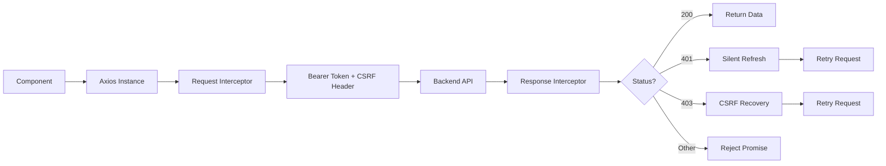

# API Integration

> **Status:** ✅ IMPLEMENTED  
> **Source:** `src/core/services/api.ts`  
> **Client:** Axios with interceptors for auth and CSRF

## Architecture



## Axios Instances

**Source:** `src/core/services/api.ts`

### Primary Instance (`api`)

Used for all API calls except token refresh:

```typescript
const api = axios.create({
  baseURL: import.meta.env.VITE_API_BASE_URL || '/api',
  withCredentials: true,  // Send httpOnly cookies
});
```

### Auth Instance (`authApi`)

Separate instance for `/auth/refresh` only — avoids infinite interceptor loop:

```typescript
const authApi = axios.create({
  baseURL: import.meta.env.VITE_API_BASE_URL || '/api',
  withCredentials: true,
});
```

## Request Interceptor

Adds authentication headers to every outgoing request:

| Header | Value | Source |
|--------|-------|--------|
| `Authorization` | `Bearer <accessToken>` | In-memory token |
| `X-CSRF-Token` | `<csrfToken>` | localStorage |

## Response Interceptor

Handles two scenarios:

### 401 Unauthorized → Silent Refresh

1. Extract refresh token from httpOnly cookie
2. Call `/auth/refresh` via `authApi`
3. Extract new access token from response
4. Update in-memory token
5. Retry original request

Refresh is **de-duplicated** — concurrent 401s share a single refresh promise.

### 403 Forbidden → CSRF Recovery

1. Fetch new CSRF token from `/auth/csrf`
2. Update localStorage
3. Retry original request with new CSRF token

## Token Storage Model

| Token | Storage | Lifetime |
|-------|---------|----------|
| Access token | In-memory (JS variable) | ~15 minutes |
| Refresh token | httpOnly cookie | ~7 days |
| CSRF token | localStorage | Until refresh |
| Session hint | localStorage | Until logout |

**Security rationale:** Access token never touches localStorage to prevent XSS extraction. Refresh token in httpOnly cookie prevents JavaScript access. CSRF token in localStorage enables double-submit pattern.

## API Base URL

- **Production:** `VITE_API_BASE_URL` environment variable
- **Development:** Vite proxy (`/api` → `http://localhost:3000`)
- **Fallback:** `/api` (relative path)

## Service Files

| Service | Source | Purpose |
|---------|--------|---------|
| `chain.service` | `features/student/services/chain.service.ts` | Blockchain interactions |
| `tokenBalance` | `features/student/services/tokenBalance.ts` | CP balance management |
| `lab.service` | `features/student/services/lab.service.ts` | Lab flag verification, progress |
| `pwa` | `features/student/services/pwa.ts` | PWA install prompt |

## Dev Proxy

Configured in `vite.config.ts`:

```typescript
proxy: {
  '/api':     { target: 'http://localhost:3000', changeOrigin: true },
  '/uploads': { target: 'http://localhost:3000', changeOrigin: true },
}
```

## Error Response Format

All API errors follow a standard shape:

```typescript
{
  error: string;        // Human-readable message
  code?: string;        // Machine-readable code
  statusCode: number;   // HTTP status
}
```

Special error codes trigger specific UI behavior:

| Code | Behavior |
|------|----------|
| `EMAIL_NOT_VERIFIED` | Redirect to verify-email page |
| `ACCOUNT_LOCKED` | Show lockout message |
| `CSRF_INVALID` | Auto-recover with new CSRF token |
