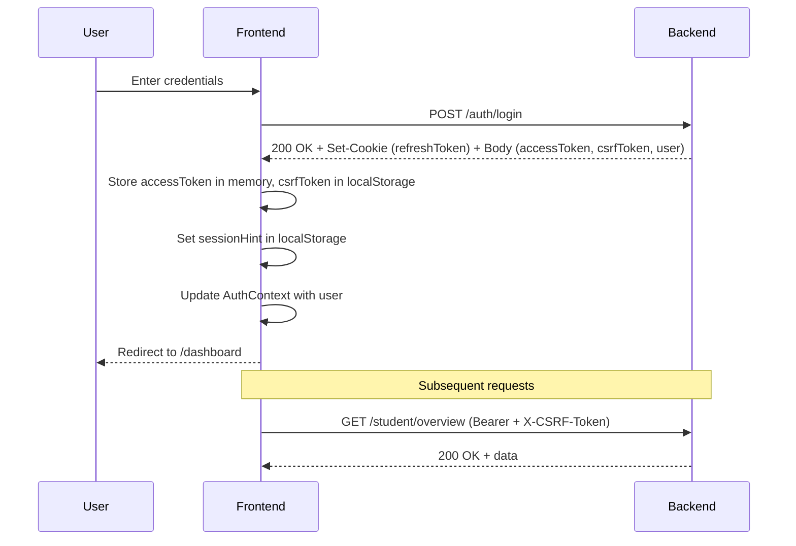

# Authentication

## Flow Overview



## Registration

**Endpoint:** `POST /auth/register`

Fields: `email`, `username`, `password`, `displayName`

Response: User object + tokens (same as login flow).

## Login

**Endpoint:** `POST /auth/login`

Fields: `email`, `password`

Response:
```json
{
  "accessToken": "...",
  "csrfToken": "...",
  "user": { "uid": "...", "username": "...", "email": "...", "role": "...", ... }
}
```

Set-Cookie: `refreshToken=<token>; HttpOnly; Secure; SameSite=Strict`

## Token Refresh

Triggered automatically on any 401 response:

1. `authApi.post('/auth/refresh')` — sends httpOnly refresh cookie
2. Response contains new `accessToken` and optionally new `csrfToken`
3. Original request is retried with new token

**De-duplication:** Multiple concurrent 401s share a single refresh promise to prevent race conditions.

## CSRF Protection

Double-submit pattern:

1. Backend sets `csrfToken` in response body during login/refresh
2. Frontend stores in localStorage
3. Every request includes `X-CSRF-Token` header
4. Backend compares header value with httpOnly `csrf_token` cookie
5. On 403 (CSRF mismatch), frontend fetches new CSRF token and retries

## Session Management

- **Session hint** (`localStorage`): Boolean indicating a session exists. Used to trigger silent refresh on page load without exposing tokens.
- **Logout:** Clears in-memory token, localStorage entries, and calls `POST /auth/logout` to clear httpOnly cookies.

## Protected Routes

Two guard components wrap route elements:

### StudentOnly

```tsx
if (!user) return <Navigate to="/login" />;
if (user.isAdmin) return <Navigate to={ADMIN_PATH} />;
return children;
```

### AdminOnly

```tsx
if (!user) return <Navigate to="/login" />;
if (!user.isAdmin) return <Navigate to="/dashboard" />;
return children;
```

## User Object Shape

```typescript
interface User {
  uid: string;
  username: string;
  email: string;
  displayName: string;
  role: 'student' | 'admin';
  cp: number;
  avatar: string | null;
  bio: string;
  handle: string;
  socialLinks: Record<string, string>;
  joinedAt: string;
}
```

## Security Properties

| Property | Implementation |
|----------|---------------|
| Access token storage | In-memory only (never localStorage) |
| Refresh token storage | httpOnly cookie |
| XSS protection | DOMPurify, CSP headers |
| CSRF protection | Double-submit pattern |
| Password hashing | bcrypt (backend) |
| Secure cookies | `Secure; SameSite=Strict` |
