# Hacker Protocol Bootcamp

> **Status:** ✅ FULLY IMPLEMENTED  
> **Config:** `src/features/student/constants/bootcampConfig.ts` (4028 lines)  
> **Pages:** `BootcampCoursePage`, `BootcampRoomPage`

## Overview

The Hacker Protocol Bootcamp (HPB) is a structured cybersecurity training program delivered entirely in the browser.

**Config source:** `src/features/student/constants/bootcampConfig.ts` (4028 lines)

## Structure

```mermaid
graph TD
    A[HPB] --> B[Phase 1: Hacker Mindset]
    A --> C[Phase 2: Networking]
    A --> D[Phase 3: Linux & Terminal]
    A --> E[Phase 4: Web & Backend]
    A --> F[Phase 5: Social Engineering]
    B --> B1[Room 1: Intro to Offensive Security]
    B --> B2[Room 2: Ethics & Legal]
    B --> B3[Room 3: Setting Up Lab]
    B --> B4[Room 4: Your First Hack]
    C --> C1[Room 1: Network Fundamentals]
    C --> C2[Room 2: TCP/IP Deep Dive]
    C --> C3[Room 3: Network Scanning]
    D --> D1[Room 1: Linux Fundamentals]
    D --> D2[Room 2: File System]
    D --> D3[Room 3: Text Processing]
    D --> D4[Room 4: Bash Scripting]
    E --> E1[Room 1: HTTP Protocol]
    E --> E2[Room 2: Web Architecture]
    E --> E3[Room 3: SQL Injection]
    E --> E4[Room 4: XSS Attacks]
    E --> E5[Room 5: API Security]
    F --> F1[Room 1: Social Engineering]
    F --> F2[Room 2: Phishing]
    F --> F3[Room 3: Pretexting]
    F --> F4[Room 4: Physical Security]
```



## Modules

| Phase | Name | Rooms | Color |
|-------|------|-------|-------|
| 1 | Hacker Mindset | 4 | `#06B66F` (Green) |
| 2 | Networking | 3 | `#60A5FA` (Blue) |
| 3 | Linux & Terminal | 4 | `#A78BFA` (Purple) |
| 4 | Web & Backend | 5 | `#F59E0B` (Amber) |
| 5 | Social Engineering | 4 | `#EF4444` (Red) |

**Total: 5 modules, 18 rooms**

## Room Structure

Each room contains:

```typescript
interface BootcampRoom {
  id: string;
  title: string;
  overview: string;
  estimatedMinutes: number;
  steps: BootcampStep[];
}

interface BootcampStep {
  title: string;
  instruction: string;  // GFM markdown
  image: string | null; // null = placeholder
}
```

## Step Content Format

Steps support GitHub Flavored Markdown:
- Fenced code blocks with syntax highlighting
- Inline code
- Bold, italic, bold+italic
- Ordered and unordered lists
- Headings, blockquotes, horizontal rules
- Plain prose

## Components

### RoomCard

**Source:** `src/features/student/components/bootcamp-course/RoomCard.tsx`

Displays a room in the curriculum browser:
- Cover image with grayscale filter when locked
- Room number badge
- Lock/completed status indicators
- Step count badge
- Estimated duration
- Canvas doodle annotations (user can draw on the card)
- Progress bar (3px accent bar)

### StepCard

**Source:** `src/features/student/components/bootcamp-room/StepCard.tsx`

Renders individual steps within a room:
- Step number (or checkmark if viewed)
- Instruction content via `CodeBlockRenderer`
- Optional `StepImage`
- Bookmark toggle
- "Got It" toggle for progress tracking
- Step notes
- Report issue link

## Progress Tracking

- Steps marked as viewed when user scrolls past
- Rooms marked complete when all steps viewed
- Phase progress calculated from room completions
- Session timer tracks time spent in room
- Progress persisted via API calls

## Keyboard Navigation

| Key | Action |
|-----|--------|
| `←` / `→` | Previous/next step |
| `Q` | Toggle quiz |
| `J` | Jump to step menu |
| `F` | Toggle fullscreen |

## Navigation

- **Curriculum browser:** `/dashboard/bootcamps/:bootcampId`
- **Room view:** `/dashboard/bootcamps/:bootcampId/phases/:phaseId/rooms/:roomId`
- **Sidebar:** Phase/room tree navigation (desktop + mobile)
- **Jump menu:** Quick step navigation overlay

## Recent Room Features (Implemented)

The following features were added to the bootcamp room page and are now part of the living codebase:

- **Keyboard Navigation** — Arrow keys (prev/next step), Q (quiz), J (jump menu), F (fullscreen). Ignores keypresses when typing in inputs or modals open. Visual hints on desktop.
- **Copy Code Buttons** — Auto-detects code blocks via regex, inline copy on hover, 2s "Copied" confirmation.
- **Estimated Time Display** — Shows `estimatedMinutes` per room, total step count, and live session timer.
- **Jump-to-Step Menu** — Quick navigation overlay for jumping to any step in the current room.
- **Step Bookmarking** — localStorage-persisted bookmarks per bootcamp (`hpb_bookmarks_{bootcampId}`).
- **Report Issue Modal** — `POST /student/report-issue` endpoint for flagging content problems.
- **Session Timer** — Tracks time spent in room, displayed in header.
- **Fullscreen Mode** — Toggle via F key or button, uses Fullscreen API.

Key components: `CopyButton`, `InstructionWithCodeBlocks`, `KeyboardHints`, `JumpMenu`, `ReportIssueModal`.
