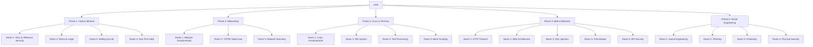

# Hacker Protocol Bootcamp

> **Status:** ✅ FULLY IMPLEMENTED (V2 Architecture Available)  
> **Last Updated:** 2026-10-07  
> **Config:** `src/features/student/constants/bootcampConfig.ts` (4028 lines, legacy)  
> **V2 Content:** `src/features/student/data/bootcamp-v2/` (semantic blocks)  
> **Pages:** `HpbPage` (public) · `BootcampCoursePage`, `BootcampRoomPage` (student)

## Overview

The Hacker Protocol Bootcamp (HPB) is QYVORA's flagship structured cybersecurity training program delivered entirely in the browser. The bootcamp uses a phase-based curriculum with hands-on rooms and integrated learning assessments.

**Architecture:** The bootcamp is transitioning to Learning System V2, which uses semantic learning blocks instead of Markdown strings. See `LEARNING_V2_STATUS.md` for migration details.

## Structure


```mermaid
graph TD
    A[HPB] --> B[Phase 1: Hacker Mindset]
    A --> C[Phase 2: Networking]
    A --> D[Phase 3: Linux & Terminal]
    A --> E[Phase 4: Web & Backend]
    A --> F[Phase 5: Social Engineering]
    B --> B1[Room 1: Intro to Offensive Security]
    B --> B2[Room 2: Ethics & Legal]
    B --> B3[Room 3: Setting Up Lab]
    B --> B4[Room 4: Your First Hack]
    C --> C1[Room 1: Network Fundamentals]
    C --> C2[Room 2: TCP/IP Deep Dive]
    C --> C3[Room 3: Network Scanning]
    D --> D1[Room 1: Linux Fundamentals]
    D --> D2[Room 2: File System]
    D --> D3[Room 3: Text Processing]
    D --> D4[Room 4: Bash Scripting]
    E --> E1[Room 1: HTTP Protocol]
    E --> E2[Room 2: Web Architecture]
    E --> E3[Room 3: SQL Injection]
    E --> E4[Room 4: XSS Attacks]
    E --> E5[Room 5: API Security]
    F --> F1[Room 1: Social Engineering]
    F --> F2[Room 2: Phishing]
    F --> F3[Room 3: Pretexting]
    F --> F4[Room 4: Physical Security]
```

## Modules

| Phase | Name | Rooms | Color |
|-------|------|-------|-------|
| 1 | Hacker Mindset | 4 | `#06B66F` (Green) |
| 2 | Networking | 3 | `#60A5FA` (Blue) |
| 3 | Linux & Terminal | 4 | `#A78BFA` (Purple) |
| 4 | Web & Backend | 5 | `#F59E0B` (Amber) |
| 5 | Social Engineering | 4 | `#EF4444` (Red) |

**Total: 5 modules, 18 rooms**

## Room Structure

### Legacy Structure (Current Implementation)

Each room currently uses the legacy structure:

```typescript
interface BootcampRoom {
  id: string;
  title: string;
  overview: string;
  estimatedMinutes: number;
  steps: BootcampStep[];
}

interface BootcampStep {
  title: string;
  instruction: string;  // GFM markdown
  image: string | null; // null = placeholder
  quiz?: Quiz;          // Optional inline quiz
}
```

### V2 Structure (Semantic Blocks)

The V2 architecture uses semantic learning blocks:

```typescript
interface BootcampRoomV2 {
  id: string;
  title: string;
  overview: string;
  estimatedMinutes: number;
  units: LearningUnit[];  // V2: semantic blocks instead of markdown
}

interface LearningUnit {
  id: string;
  number: number;
  title: string;
  blocks: LearningBlock[];  // Array of semantic blocks (mission, objective, command, etc.)
  image?: { src: string; alt: string };
  completionType: 'view' | 'quiz' | 'flag' | 'manual';
}
```

**V2 Block Types Available:**
- `mission` - What to accomplish
- `objective` - Learning outcomes (bulleted list)
- `text` - General explanation
- `concept` - Key idea requiring retention
- `command` - Terminal command with explanation
- `observe` - Direct attention to something specific
- `think` - Reasoning question
- `do` - Practice instructions
- `checkpoint` - Quiz/flag validation with progressive hints
- `recall` - Summary for retention
- And 11 more... (see `LEARNING_CONTENT_ARCHITECTURE.md`)

**Migration Status:**
- ✅ V2 architecture complete (types, renderer, 12 block components)
- 📋 Pilot: Phase 1, Room 1 planned as first V2 migration
- 📋 Full migration: 18 rooms to be converted to semantic blocks

## Step Content Format

### Legacy Format (Current)

Steps support GitHub Flavored Markdown:
- Fenced code blocks with syntax highlighting
- Inline code
- Bold, italic, bold+italic
- Ordered and unordered lists
- Headings, blockquotes, horizontal rules
- Plain prose

Rendered via `EducationalMarkdownRenderer` component.

### V2 Format (Semantic Blocks)

V2 content uses structured semantic blocks instead of Markdown:

```typescript
// Example V2 unit (step)
{
  id: 'phase1-room1-step1',
  number: 1,
  title: 'Introduction to Offensive Security',
  blocks: [
    {
      type: 'mission',
      id: 'mission',
      mission: 'Learn the fundamentals of ethical hacking'
    },
    {
      type: 'objective',
      id: 'objectives',
      objectives: [
        'Understand offensive security principles',
        'Learn the hacker mindset',
        'Set up your lab environment'
      ]
    },
    {
      type: 'text',
      id: 'intro',
      content: 'Offensive security is...'
    },
    {
      type: 'command',
      id: 'cmd-nmap',
      command: 'nmap -sV target.com',
      explanation: {
        what: 'Scans target for service versions',
        watch: 'Port numbers and service names'
      }
    },
    {
      type: 'checkpoint',
      id: 'quiz',
      checkpointType: 'quiz',
      quiz: { questions: [/* quiz data */] }
    }
  ],
  completionType: 'quiz'
}
```

**Benefits:**
- Pedagogically structured (mission → objective → practice → recall)
- Type-safe (no Markdown parsing errors)
- Consistent presentation across all learning surfaces
- Easier to maintain and update
- Better accessibility support

## Components

### Legacy Components (Current)

#### RoomCard

**Source:** `src/features/student/components/bootcamp-course/RoomCard.tsx`

Displays a room in the curriculum browser:
- Cover image with grayscale filter when locked
- Room number badge
- Lock/completed status indicators
- Step count badge
- Estimated duration
- Progress bar (3px accent bar)

#### StepCard

**Source:** `src/features/student/components/bootcamp-room/StepCard.tsx`

Renders individual steps within a room:
- Step number (or checkmark if viewed)
- Instruction content via `CodeBlockRenderer`
- Optional `StepImage`
- Integrated quiz support

### V2 Components (Semantic Blocks)

#### LearningContentRenderer

**Source:** `src/shared/learning/renderer/LearningContentRenderer.tsx`

Renders V2 semantic blocks using the block registry:
- Automatically selects correct component for each block type
- Handles block spacing and layout
- Provides consistent presentation
- Full accessibility support

#### Block Components (12 implemented)

**Narrative blocks:**
- `TextBlock` - General explanations
- `MissionBlock` - Learning mission with accent styling
- `ObjectiveBlock` - Bulleted learning outcomes
- `ConceptBlock` - Key concepts requiring retention
- `DebriefBlock` - Explanations of what happened
- `RecallBlock` - Summary for retention

**Evidence blocks:**
- `ObserveBlock` - Direct attention to specifics
- `EvidenceBlock` - Raw output/artifacts display

**Interactive blocks:**
- `CommandBlock` - Terminal commands with copy button
- `DoBlock` - Practice instructions
- `ThinkBlock` - Reasoning questions
- `CheckpointBlock` - Quiz/flag validation with progressive hints

All components follow QYVORA design system:
- Semantic color tokens (text-accent, text-danger, text-warning)
- Blog typography (`font-mono leading-[2]`)
- Accessibility (48px touch targets, ARIA labels, keyboard nav)
- No "card soup" - cards only for semantic emphasis

## Progress Tracking

- Steps/units marked as viewed when user scrolls past
- Rooms marked complete when all steps viewed (or quiz passed for V2)
- Phase progress calculated from room completions
- Session timer tracks time spent in room
- Progress persisted via API calls (`POST /api/student/modules/:id/rooms/:id/complete`)

**V2 Compatibility:**
- `LearningUnit.completionType` determines validation method:
  - `'view'` - Mark complete when viewed
  - `'quiz'` - Require quiz passing
  - `'flag'` - Require flag submission
  - `'manual'` - User marks complete
- Progress API unchanged (adapters translate V2 blocks to legacy format)
- Transparent migration - progress tracking works with both legacy and V2 content

## CP Rewards

Completing bootcamp rooms awards Cyber Points (CP):
- Room completion: Variable CP based on difficulty and content
- Phase completion: Bonus CP for completing all rooms in a phase
- First completion: Extra CP for first-time completions
- Recorded on blockchain for immutable audit trail

**Reward flow:**
1. User completes room (all steps viewed or quiz passed)
2. Backend validates completion
3. CP transaction created in MongoDB
4. Event enqueued to chain outbox
5. Chain worker writes immutable completion event
6. User balance updated

## Step Navigation

Steps use the shared walkthrough model (`FocusedStepList` + `LearningNav`): one expanded step at a time, compact Done/Next/Locked rows for the rest, Previous/Next buttons (single `Complete` on the final step). See `docs/LEARNING-WALKTHROUGH-REFACTOR.md`.

## Navigation

- **Public overview:** `/hpb` (`HpbPage`) — the single public bootcamp page. Phase summary cards plus a
  `Rooms by phase` disclosure list carry the full curriculum inline; there are no per-phase public routes.
- **Curriculum browser:** `/dashboard/bootcamps/:bootcampId`
- **Room view:** `/dashboard/bootcamps/:bootcampId/phases/:phaseId/rooms/:roomId`

## Public Phase/Room Cards

The landing page's bootcamp section renders a mobile-only static list of all 5 phases (featured-card styling: text left, avatar right, no switching) and the desktop cycling bento. All public HPB phase/room cards follow the [Learning Card Rule](DESIGN_SYSTEM.md#learning-card-rule).

## Recent Room Features (Implemented)

The following features are part of the current bootcamp room page:

**Core Features:**
- **Estimated Time Display** — Shows `estimatedMinutes` per room, total step/unit count, and live session timer
- **Session Timer** — Tracks time spent in room, displayed in header, persisted across sessions
- **Room Quiz** — Single graded quiz (`QuizModal`, `POST /api/student/quiz`) gating room completion
- **Report Issue Modal** — `POST /api/student/report-issue` endpoint for flagging content problems, linked from page footer
- **Room Completion Celebration** — Animated celebration modal on room completion with CP reward display
- **Progressive Hints** — Available in checkpoints, reveal hints incrementally to guide learning
- **Image Support** — Step images displayed with proper responsive layout and alt text

**Navigation:**
- **FocusedStepList** — One expanded step at a time with compact Done/Next/Locked rows
- **LearningNav** — Previous/Next buttons, single Complete button on final step
- **Inline Room List** — All rooms listed inline (no expand/collapse toggles)
- **Step Auto-Scroll** — Automatically scrolls to activated step

**Key components:** `StepCard`, `QuizModal`, `ReportIssueModal`, `RoomCompletionCelebration`, `FocusedStepList`, `LearningNav`

**Recent Refactors (2026):**
- Removed per-step chrome (bookmark, "Got It" button)
- Removed per-step inline quiz (consolidated to room-level quiz)
- Removed per-step report button (moved to footer)
- Simplified step navigation (removed expand toggles)
- Added Learning V2 semantic block architecture (parallel to legacy)

## V2 Migration Plan

The Hacker Protocol Bootcamp is being migrated to Learning System V2 in phases:

**Phase 4 (Pilot) - 📋 Planned:**
- Target: Phase 1, Room 1 ("Introduction to Offensive Security")
- Implementation: Dual routes (legacy + v2) for testing
- Goal: Validate V2 architecture with real content

**Phase 6 (Full Migration) - 📋 Planned:**
- All 18 rooms converted to semantic blocks
- Legacy Markdown content replaced
- StepCard component deprecated in favor of LearningContentRenderer
- bootcampConfig.ts replaced with structured data files

**Benefits of V2:**
- Pedagogically structured content (mission → objective → practice → recall)
- Type-safe content (no Markdown parsing errors)
- Consistent presentation across bootcamp, courses, and labs
- Better accessibility support
- Easier content maintenance and updates
- Reusable block components

See `LEARNING_V2_STATUS.md` and `LEARNING_V2_IMPLEMENTATION_GUIDE.md` for complete migration details.

## Related Documentation

- **LEARNING_SYSTEM.md** - Overview of the complete learning system
- **LEARNING_V2_STATUS.md** - V2 architecture status and migration plan
- **LEARNING_V2_IMPLEMENTATION_GUIDE.md** - Developer guide for V2 implementation
- **LEARNING_CONTENT_ARCHITECTURE.md** - Complete type system reference
- **LEARNING_BLOCKS_UI_REFERENCE.md** - Block component documentation
- **DESIGN_SYSTEM.md** - QYVORA design system and UI rules
