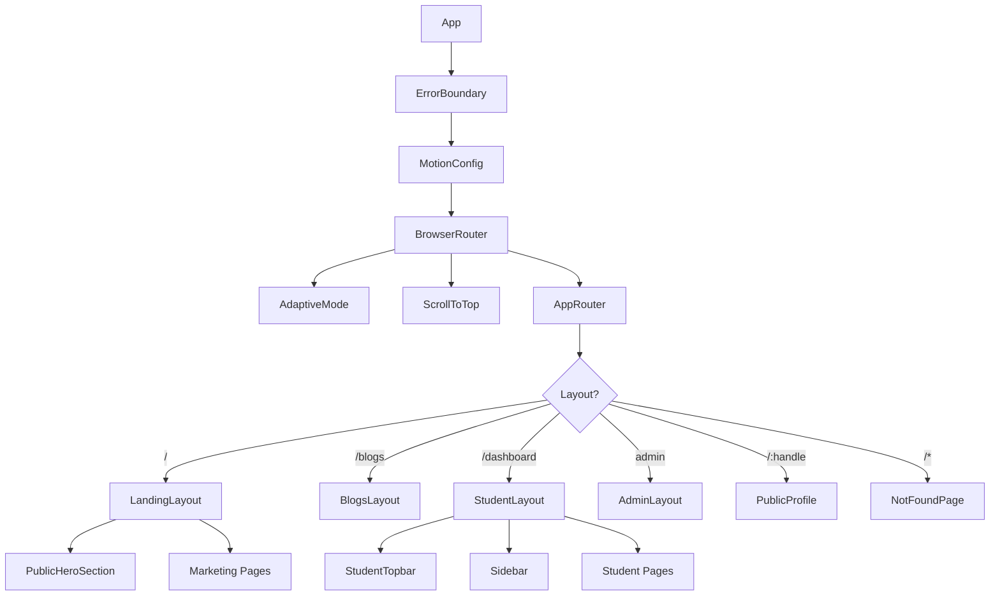

# Component Architecture

## App Shell

```
ErrorBoundary (scope="App")
└── MotionConfig (reducedMotion="user")
    └── BrowserRouter
        ├── AdaptiveMode
        ├── ScrollToTop
        └── AppRouter
```

**Source:** `src/app/App.tsx`

The root component is a configuration shell — no visible UI. It wraps the entire app in error handling, motion configuration, and routing.

## Layouts (Lazy-Loaded)

| Layout | Route Scope | Source |
|--------|-------------|--------|
| `LandingLayout` | `/`, `/terms`, `/anansi`, `/team`, `/hpb`, `/courses`, etc. | `src/shared/layouts/` |
| `BlogsLayout` | `/blogs`, `/blogs/:slug` | `src/shared/layouts/` |
| `StudentLayout` | `/dashboard/**` | `src/features/student/layouts/` |
| `AdminLayout` | `{ADMIN_PATH}/**` | `src/features/admin/layouts/` |

All layouts are loaded via `React.lazy()` with `<Suspense>` fallback.

## Route Guards

| Guard | Behavior |
|-------|----------|
| `StudentOnly` | Redirects to `/login` if no user; to admin path if `isAdmin` |
| `AdminOnly` | Redirects to `/login` if no user; to `/dashboard` if not admin |

## Component Hierarchy



## Shared Components (`src/shared/components/`)

### UI Primitives (`ui/`)

| Component | Purpose |
|-----------|---------|
| `BottomSheet` | Mobile bottom sheet overlay |
| `Card` | Card primitives (CardBase, CardMedia, CardStat) |
| `Dialog` | Radix dialog wrapper with `DialogContent` |
| `NavCard` | Navigation card with icon, label, badge |
| `SimpleHeading` | Reusable section heading |
| `Skeleton` | Loading skeleton placeholder |
| `StatCounter` | Animated number counter |
| `Tooltip` | Radix tooltip wrapper |

### Layout Components (`layout/`)

| Component | Purpose |
|-----------|---------|
| `Navbar` | Public/marketing page navigation |
| `Footer` | Public page footer |

### Standalone Components

| Component | Purpose |
|-----------|---------|
| `ErrorBoundary` | Scope-based error capture with fallback UI |
| `ScrollReveal` | Intersection Observer scroll animations |
| `ScrollToTop` | Reset scroll on route change |
| `SEO` | Dynamic meta tags via react-helmet-async |
| `PublicHeroSection` | Public page hero with Globe, dark bg (`bg-bg`), `data-nav-invert` |
| `ScenarioCard` | Lab scenario selection card |
| `ShareProfile` | Profile sharing modal |
| `LanguageSwitcher` | i18n language selector |
| `ConsentBanner` | Storage consent notification |
| `CommunityPopup` | Community join prompt |
| `PageLoader` | Full-page loading spinner |
| `Identicon` | Jdenticon-based user avatar |
| `ChainLogo` | QYVORA chain logo |
| `CpLogo` | Cyber Points logo |
| `BootcampBadge` | Bootcamp completion badge |
| `RelatedContent` | Related learning content recommendations |

### Feature Directories

| Directory | Contents |
|-----------|----------|
| `backgrounds/` | GridBoxedBackground decorative patterns |
| `blog/` | Blog content renderer |
| `brand/` | Logo component |
| `card-grid/` | CardGrid layout wrapper |
| `carousel/` | Carousel component with auto-play |
| `courses/` | Course-specific components |
| `dashboard/` | EmptyState and dashboard primitives |
| `icons/` | 45+ custom SVG icons (see ICON_SYSTEM.md) |
| `walkthrough/` | WalkthroughLayout and WalkthroughStep |

## Feature Components (`src/features/`)

| Feature | Path | Description |
|---------|------|-------------|
| `admin` | `features/admin/` | Admin dashboard, user management |
| `auth` | `features/auth/` | Login, register, forgot password |
| `marketing` | `features/marketing/` | Landing pages, public pages |
| `student` | `features/student/` | Main student experience (largest) |

### Student Feature Structure

```
features/student/
├── components/
│   ├── layout/          # StudentTopbar (desktop + mobile nav)
│   ├── bootcamp-room/   # StepCard, progress tracking
│   ├── bootcamp-course/ # RoomCard, curriculum browser
│   ├── dashboard/       # DashboardHero, stats widgets
│   ├── learning/        # LearningOverviewCard, progress
│   ├── SimulatedTerminal/ # Terminal engine
│   └── simulations/     # Lab simulation content
├── constants/           # bootcampConfig (4028 lines)
├── data/                # Static data (courses, labs, quizzes)
├── hooks/               # Student-specific hooks
├── layouts/             # StudentLayout
├── pages/               # 20+ page components
├── services/            # chain.service, pwa, tokenBalance
└── utils/               # Student utilities
```
