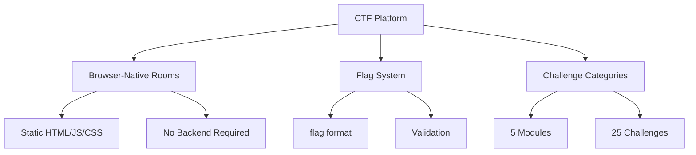

# CTF Platform

> **Status:** 📋 PLANNED - Design Complete, Not Yet Implemented  
> **See Also:** `CTF_PLAN.md` for detailed implementation plan  
> **Roadmap:** `_ROADMAP.md` for implementation timeline

## Overview

The QYVORA CTF (Capture The Flag) platform will provide browser-native cybersecurity challenges deployed on Netlify.

**Plan source:** `docs/CTF_PLAN.md` (449 lines)  
**Challenge infrastructure:** PLANNED - Not yet created

## ⚠️ Implementation Status

**NONE OF THE CTF PLATFORM EXISTS YET.** This document describes a planned feature.

### What Actually Exists
- ✅ Labs with flag validation (in lab simulations)
- ✅ Lab exercises with completion markers

### What Does NOT Exist
- ❌ NO dedicated CTF routes or pages
- ❌ NO separate CTF rooms repository  
- ❌ NO CTF challenge infrastructure
- ❌ NO flag submission UI specific to CTF
- ❌ NO `/infrastructure/hpb-ctf-infrastructure/` directory

**Note:** The "flags" mentioned in labs are completion markers for lab exercises, not CTF challenges.

## Architecture



## Flag Format

```
flag{<description-of-solution>}
```

Flags are embedded in challenge content and validated client-side.

## Challenge Modules

### Module 1: Hacker Mindset (5 challenges)

| Challenge | Directory |
|-----------|-----------|
| Hidden in Plain Sight | `module-1-hacker-mindset/hidden-in-plain-sight/` |
| Metadata Detective | `module-1-hacker-mindset/metadata-detective/` |
| Trust Boundaries | `module-1-hacker-mindset/trust-boundaries/` |
| Observation Test | `module-1-hacker-mindset/observation-test/` |
| Ethical Dilemma | `module-1-hacker-mindset/ethical-dilemma/` |

### Module 2: Networking (5 challenges)

| Challenge | Directory |
|-----------|-----------|
| DNS Detective | `module-2-networking/dns-detective/` |
| Port Scanner | `module-2-networking/port-scanner/` |
| HTTP Headers | `module-2-networking/http-headers/` |
| Packet Sniffer | `module-2-networking/packet-sniffer/` |
| Subnet Calculator | `module-2-networking/subnet-calculator/` |

### Module 3: Linux (5 challenges)

| Challenge | Directory |
|-----------|-----------|
| File Permissions | `module-3-linux/file-permissions/` |
| Environment Variables | `module-3-linux/env-vars/` |
| Log Analysis | `module-3-linux/log-analysis/` |
| Process Inspector | `module-3-linux/process-inspector/` |
| Bash Scripting | `module-3-linux/bash-scripting/` |

### Module 4: Web (5 challenges)

| Challenge | Directory |
|-----------|-----------|
| SQL Injection | `module-4-web/sql-injection/` |
| XSS Attack | `module-4-web/xss-attack/` |
| API Enumeration | `module-4-web/api-enumeration/` |
| JWT Decode | `module-4-web/jwt-decode/` |
| CSRF Attack | `module-4-web/csrf-attack/` |

### Module 5: Social Engineering (5 challenges)

| Challenge | Directory |
|-----------|-----------|
| Phishing Email | `module-5-social-engineering/phishing-email/` |
| Pretexting | `module-5-social-engineering/pretexting/` |
| OSINT | `module-5-social-engineering/osint/` |
| Tailgating | `module-5-social-engineering/tailgating/` |
| Baiting | `module-5-social-engineering/baiting/` |

## Deployment

- Static HTML/CSS/JS files
- Deployed to Netlify as separate sites
- No backend required
- Each challenge is self-contained

## Integration with Main Platform

- CTF challenges are referenced from the bootcamp curriculum
- Challenge completions tracked separately from lab completions
- CP rewards for CTF completions (future implementation)
