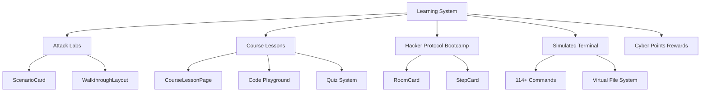

# Learning System

> **Status:** ✅ IMPLEMENTED  
> **See Also:** `SIMULATIONS.md` for detailed simulation documentation  
> **Components:** Labs, Courses, Bootcamp, Terminal Simulator

## Overview

QYVORA's learning system combines four fully-implemented interconnected components:

## Attack Labs

5 hands-on labs covering offensive security:

| Lab | Route | Difficulty |
|-----|-------|------------|
| Privilege Escalation | `/dashboard/labs/privesc` | Advanced |
| Password Cracking | `/dashboard/labs/passwords` | Intermediate |
| SQL Injection | `/dashboard/labs/sql-injection` | Intermediate |
| OSINT Recon | `/dashboard/labs/osint` | Beginner |
| Kill Chain | `/dashboard/labs/kill-chain` | Advanced |

Each lab contains multiple scenarios with varying difficulty. Scenarios are defined in `src/features/student/data/simulations/`.

**Data files:**
- `privesc-scenarios.ts` — Privilege escalation scenarios
- `password-exercises.ts` — Password cracking exercises
- `sql-injection-data.ts` — SQL injection scenarios
- `osint-data.ts` — OSINT scenarios
- `kill-chain-data.ts` — Kill chain scenarios

## Course Lessons

Courses are structured learning content with:

- **12 courses** across 6 categories (terminal, networking, programming, web-security, wireless, tools)
- **Lessons** with text content, images, and code blocks
- **Code playground** for hands-on exercises
- **Quiz system** for knowledge verification
- **Progress tracking** across enrolled courses

**Data source:** `src/features/student/data/courses/`

## Cyber Points (CP)

CP is the in-app reward currency:

- Earned by completing labs, courses, and bootcamp rooms
- Spent in the marketplace for premium content
- Balance tracked on the blockchain (source of truth)
- Displayed in the topbar via `CpLogo` component
- Balance fetched from `/student/overview` API

## Progress Tracking

Progress is tracked at multiple levels:

- **Lab completion:** Scenario solved → flag verified → CP awarded
- **Course progress:** Lessons viewed → quiz score → completion percentage
- **Bootcamp progress:** Steps viewed → room completion → phase progress
- **Overall:** Dashboard shows aggregate stats via `LearningOverviewCard`
