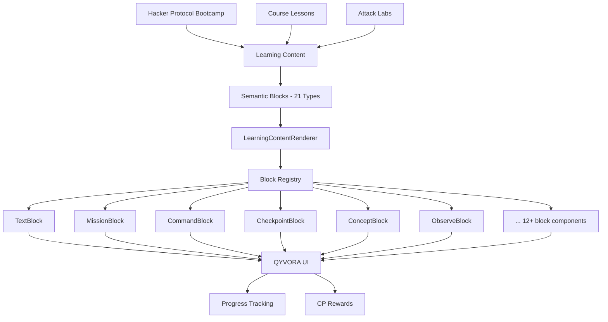

# Learning System

> **Status:** ✅ IMPLEMENTED (V2 Architecture Complete)  
> **Last Updated:** 2026-10-07  
> **See Also:**  
> - `LEARNING_V2_STATUS.md` for V2 architecture overview
> - `LEARNING_V2_IMPLEMENTATION_GUIDE.md` for V2 development guide  
> - `LEARNING_CONTENT_ARCHITECTURE.md` for semantic block types  
> - `LEARNING_BLOCKS_UI_REFERENCE.md` for component documentation  
> - `SIMULATIONS.md` for detailed simulation documentation  

## Overview

QYVORA's learning system underwent a major refactor to **Learning System V2** in 2026, transitioning from a Markdown-driven documentation model to a **semantic learning block architecture**. This enables structured, pedagogically-sound content that separates concerns between content (what we teach), learning semantics (how we teach), and presentation (how it looks).

### System Architecture (V2)


```mermaid
graph TD
    A[Learning Content] --> B[Semantic Blocks - 21 Types]
    B --> C[LearningContentRenderer]
    C --> D[Block Registry]
    D --> E1[TextBlock]
    D --> E2[MissionBlock]
    D --> E3[CommandBlock]
    D --> E4[CheckpointBlock]
    D --> E5[ConceptBlock]
    D --> E6[ObserveBlock]
    D --> EN[... 12+ block components]
    
    F[Hacker Protocol Bootcamp] --> A
    G[Course Lessons] --> A
    H[Attack Labs] --> A
    
    E1 --> I[QYVORA UI]
    E2 --> I
    E3 --> I
    E4 --> I
    E5 --> I
    E6 --> I
    EN --> I
    
    I --> J[Progress Tracking]
    I --> K[CP Rewards]
```

## Learning System V2 Architecture

## Learning System V2 Architecture

### Core Principles

**Before V2:** Everything was Markdown strings rendered as styled documentation.  
**After V2:** Content is structured as semantic learning blocks that encode pedagogical intent.

**Key improvements:**
- **Semantic structure:** 21 block types organized in 5 categories (Narrative, Visual, Evidence, Interactive, Practice)
- **Separation of concerns:** Content (data) → Learning semantics (block types) → Presentation (UI components)
- **Type safety:** Full TypeScript support with discriminated unions
- **Consistency:** All learning surfaces (bootcamp, courses, labs) use the same block system
- **Pedagogy-driven:** Block types encode teaching methods (observe → think → do → recall)

### Semantic Block Types (21 Total)

**1. Narrative Blocks (6):**
- `text` - General explanation or story
- `objective` - Learning outcomes (bulleted list)
- `mission` - What to accomplish
- `concept` - Key idea requiring retention
- `debrief` - Explanation of what happened
- `recall` - Summary for retention

**2. Visual Blocks (2):**
- `mental-model` - Interactive mental model diagrams
- `diagram` - Generic diagram renderer

**3. Evidence Blocks (2):**
- `observe` - Direct something specific to notice
- `evidence` - Raw output/artifacts to inspect

**4. Interactive Blocks (6):**
- `command` - Terminal command with explanation
- `http` - HTTP request/response display
- `code` - Syntax-highlighted code snippets
- `comparison` - Side-by-side code comparison
- `checkpoint` - Quiz/flag with progressive hints
- `hint` - Standalone progressive hint system

**5. Practice Blocks (5):**
- `think` - Reasoning question (no right answer)
- `do` - Practice instructions
- `challenge` - Reduced-scaffolding challenge
- `lab` - Lab handoff card
- `checkpoint` - (Also serves as practice validation)

### Block Registry System

All block components auto-register on import:

```typescript
import { blockRegistry } from '@/shared/learning';

// Components register themselves
blockRegistry.register('text', TextBlockComponent);
blockRegistry.register('mission', MissionBlockComponent);
// ... etc

// Renderer resolves dynamically
const Component = blockRegistry.getRenderer(block.type);
```

### Content Structure

**LearningUnit** (= step/lesson):
```typescript
{
  id: string;
  number: number;
  title: string;
  blocks: LearningBlock[];  // Array of semantic blocks
  image?: { src: string; alt: string };
  completionType: 'view' | 'quiz' | 'flag' | 'manual';
}
```

**LearningSequence** (= room/course/lab):
```typescript
{
  id: string;
  title: string;
  units: LearningUnit[];
  metadata: {
    surfaceType: 'bootcamp' | 'course-lesson' | 'attack-lab';
    difficulty?: 'beginner' | 'intermediate' | 'advanced';
    estimatedMinutes?: number;
  };
}
```

### V2 Migration Status

**✅ Phase 1-3 Complete:**
- Type system architecture
- Block registry and renderer
- 12 core block components implemented (865+ lines)
- Design system compliance (semantic tokens, accessibility, no card soup)

**📋 Phase 4-9 Planned:**
- Phase 4: HPB pilot (Phase 1, Room 1)
- Phase 5: Iterate on feedback, add missing blocks
- Phase 6: Complete HPB migration (18 rooms)
- Phase 7: Migrate courses (12 courses)
- Phase 8: Integrate labs (5 labs)
- Phase 9: Cleanup and documentation

See `LEARNING_V2_STATUS.md` for detailed migration plan.

## Attack Labs

5 hands-on labs covering offensive security:

| Lab | Route | Difficulty |
|-----|-------|------------|
| Privilege Escalation | `/dashboard/labs/privesc` | Advanced |
| Password Cracking | `/dashboard/labs/passwords` | Intermediate |
| SQL Injection | `/dashboard/labs/sql-injection` | Intermediate |
| OSINT Recon | `/dashboard/labs/osint` | Beginner |
| Kill Chain | `/dashboard/labs/kill-chain` | Advanced |

Each lab contains multiple scenarios with varying difficulty. Scenarios are defined in `src/features/student/data/simulations/`.

**Data files:**
- `privesc-scenarios.ts` — Privilege escalation scenarios
- `password-exercises.ts` — Password cracking exercises
- `sql-injection-data.ts` — SQL injection scenarios
- `osint-data.ts` — OSINT scenarios
- `kill-chain-data.ts` — Kill chain scenarios

## Course Lessons

Courses are structured learning content with:

- **12 courses** across 6 categories (terminal, networking, programming, web-security, wireless, tools)
- **Lessons** with text content, images, and code blocks
- **Code playground** for hands-on exercises
- **Quiz system** for knowledge verification
- **Progress tracking** across enrolled courses

**Data source:** `src/features/student/data/courses/`

## Cyber Points (CP)

CP is the in-app reward currency:

- Earned by completing labs, courses, and bootcamp rooms
- Spent in the marketplace for premium content
- Balance tracked on the blockchain (source of truth)
- Displayed in the topbar via `CpLogo` component
- Balance fetched from `/student/overview` API

## Progress Tracking

Progress is tracked at multiple levels:

- **Lab completion:** Scenario solved → flag verified → CP awarded
- **Course progress:** Lessons viewed → quiz score → completion percentage  
- **Bootcamp progress:** Steps viewed → room completion → phase progress
- **Overall:** Dashboard shows aggregate stats via the `ProgressionPanel` / `SkillMatrix` widgets

### V2 Progress Integration

The V2 semantic block system maintains full compatibility with existing progress tracking:
- `LearningUnit.completionType` determines validation method
- Progress API unchanged (controllers still use legacy models)
- Adapters translate between V2 blocks and legacy progress format
- Migration to V2 blocks is transparent to progress tracking system

## Terminal Simulator

The terminal simulator provides 114+ commands across a virtual file system:
- Used in labs for hands-on practice
- Simulates Linux command-line environment
- Integrated with lab scenarios for realistic training
- See `SIMULATIONS.md` for complete command reference

## Design Principles (V2)

**Content authoring best practices:**
- ✅ Use semantic blocks that match learning intent
- ✅ Keep blocks focused (one idea per block)
- ✅ Start with Mission → Objective pattern
- ✅ Use Observe → Think → Do sequence for practice
- ✅ End with Recall for retention
- ❌ Avoid giant TextBlocks (split into semantic parts)
- ❌ Don't use cards for everything (semantic emphasis only)
- ❌ Never skip checkpoints (validate understanding)

**UI compliance:**
- Semantic color tokens (text-accent/danger/warning)
- Blog typography (`font-mono leading-[2] md:leading-[2.2]`)
- Full-width reading experience
- Accessibility (48px minimum touch targets, ARIA labels, keyboard nav)
- No "card soup" - cards only for semantic emphasis
- Respect `prefers-reduced-motion`

## Related Documentation

- **LEARNING_V2_STATUS.md** - Architecture overview and migration status
- **LEARNING_V2_IMPLEMENTATION_GUIDE.md** - Developer implementation guide
- **LEARNING_CONTENT_ARCHITECTURE.md** - Complete type system reference
- **LEARNING_BLOCKS_UI_REFERENCE.md** - Block component documentation
- **SIMULATIONS.md** - Terminal simulator and command reference
- **BOOTCAMP.md** - Hacker Protocol Bootcamp details
