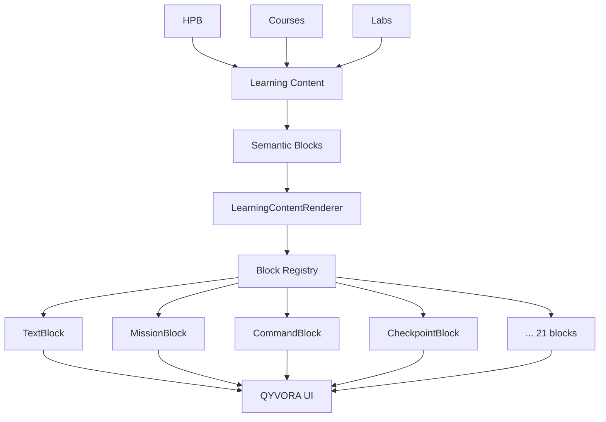

# Learning System V2 — Implementation Guide

> **For:** Developers implementing the remaining phases (5-9)  
> **Status:** Architecture complete, ready for implementation  
> **Prerequisites:** Read LEARNING_V2_STATUS.md first

---

## Quick Start

### Import and Use V2 System

```tsx
// Import types
import type { LearningUnit, LearningBlock } from '@/shared/learning';

// Import renderer and blocks (blocks auto-register)
import { LearningContentRenderer } from '@/shared/learning';

// Use in a page
function MyLearningPage() {
  const unit: LearningUnit = {
    id: 'my-unit',
    number: 1,
    title: 'Introduction',
    blocks: [
      {
        type: 'mission',
        id: 'mission',
        mission: 'Learn the basics',
      },
      {
        type: 'text',
        id: 'intro',
        content: 'This is an introduction...',
      },
    ],
    completionType: 'view',
  };
  
  return (
    <LearningContentRenderer
      unit={unit}
      context={{
        surface: 'bootcamp',
        sequenceId: 'seq-1',
        unitId: 'my-unit',
      }}
    />
  );
}
```

---

## Phase 5: Iterate on Pilot Feedback

### Goal

Refine the system based on real-world pilot usage and implement any missing block types.

### Tasks

#### 1. Collect Pilot Feedback

**What to observe:**
- Are all content patterns covered by existing blocks?
- Any awkward workarounds needed?
- Performance issues?
- UX confusion points?
- Accessibility gaps?

**How to collect:**
- User testing with actual students
- Developer feedback during content creation
- Screen reader testing
- Mobile device testing
- Performance profiling

#### 2. Implement Missing Blocks

Based on pilot feedback, implement additional block types:

**Priority 1 (Likely needed):**

```tsx
// HintBlock - Standalone progressive hints
// src/shared/learning/blocks/HintBlock.tsx
export const HintBlockComponent: React.FC<BlockRendererProps<HintBlock>> = ({ block }) => {
  const [visibleLevel, setVisibleLevel] = useState(0);
  
  return (
    <div className="space-y-2">
      {block.hints.slice(0, visibleLevel).map((hint) => (
        <div key={hint.level} className="rounded-xl border border-warning/20 bg-warning/5 px-4 py-3">
          <p className="text-xs font-black uppercase tracking-widest text-warning/60 mb-1">
            {hint.label}
          </p>
          <p className="text-sm font-mono text-warning/80 leading-[2]">
            {hint.content}
          </p>
        </div>
      ))}
      
      {visibleLevel < block.hints.length && (
        <button
          type="button"
          onClick={() => setVisibleLevel(visibleLevel + 1)}
          className="text-xs font-black uppercase tracking-widest text-text-muted hover:text-warning transition-colors"
        >
          Show hint {visibleLevel + 1}
        </button>
      )}
    </div>
  );
};
```

**Priority 2 (If needed for advanced content):**

- `CodeBlock` — Syntax-highlighted code snippets (distinct from commands)
- `HttpBlock` — HTTP request/response display
- `ComparisonBlock` — Side-by-side code comparison
- `ChallengeBlock` — Reduced-scaffolding challenges
- `LabBlock` — Lab handoff cards

**Priority 3 (Future enhancements):**

- `MentalModelBlock` — Interactive mental model diagrams
- `DiagramBlock` — Generic diagram renderer

#### 3. Optimize Performance

**Profile and optimize:**

```bash
# Build and measure
npm run build
# Analyze bundle size
npm run analyze # (if configured)

# Profile in browser
# Use React DevTools Profiler
# Measure rendering time
# Check bundle size impact
```

**Common optimizations:**
- Lazy-load heavy blocks (diagrams, interactive elements)
- Memoize expensive computations
- Virtual scrolling for long content (if needed)
- Code splitting per block type

#### 4. Enhance Accessibility

**Additional testing:**
- [ ] Test with NVDA (Windows)
- [ ] Test with JAWS (Windows)
- [ ] Test with VoiceOver (macOS/iOS)
- [ ] Test with TalkBack (Android)
- [ ] Automated tools (axe, Lighthouse)

**Common fixes:**
- Add more descriptive `aria-label`s
- Improve focus management
- Better keyboard shortcuts
- Enhanced screen reader announcements

#### 5. Polish Animations

If pilot shows need for more visual polish:

```tsx
// Add subtle animations to blocks
import { motion } from 'framer-motion';

export const ConceptBlockComponent: React.FC<...> = ({ block }) => {
  return (
    <motion.div
      initial={{ opacity: 0, y: 20 }}
      animate={{ opacity: 1, y: 0 }}
      transition={{ duration: 0.3 }}
      className="rounded-xl..."
    >
      {/* content */}
    </motion.div>
  );
};
```

**Remember:** Always respect `prefers-reduced-motion`

---

## Phase 6: Complete HPB Migration

### Goal

Migrate all 18 HPB rooms to V2 semantic blocks.

### Strategy

#### 1. Establish Content Patterns

After pilot, document patterns:

```markdown
## Pattern: Character Dialogue

Legacy:
Valkyrie: "Welcome to QYVORA..."

V2:
{
  type: 'text',
  id: 'valkyrie-intro',
  content: 'Valkyrie: "Welcome to QYVORA..."',
}

## Pattern: Bulleted List with Header

Legacy:
**Core Fields:**
- Item 1
- Item 2

V2:
{
  type: 'objective',
  id: 'core-fields',
  title: 'Core Fields',
  objectives: ['Item 1', 'Item 2'],
}
```

#### 2. Migration Order

**Phase 1 (Hacker Mindset) — 4 rooms:**
1. Room 1: Introduction to Offensive Security ✅ (Pilot)
2. Room 2: Ethics & Legal
3. Room 3: Setting Up Lab
4. Room 4: Your First Hack

**Phase 2 (Networking) — 3 rooms:**
5. Room 1: Network Fundamentals
6. Room 2: TCP/IP Deep Dive
7. Room 3: Network Scanning

**Phase 3 (Linux & Terminal) — 4 rooms:**
8. Room 1: Linux Fundamentals
9. Room 2: File System
10. Room 3: Text Processing
11. Room 4: Bash Scripting

**Phase 4 (Web & Backend) — 5 rooms:**
12. Room 1: HTTP Protocol
13. Room 2: Web Architecture
14. Room 3: SQL Injection
15. Room 4: XSS Attacks
16. Room 5: API Security

**Phase 5 (Social Engineering) — 4 rooms:**
17. Room 1: Social Engineering
18. Room 2: Phishing
19. Room 3: Pretexting
20. Room 4: Physical Security

#### 3. Content Creation Workflow

```bash
# For each room:

# 1. Create V2 content file
touch src/features/student/data/bootcamp-v2/phase{N}-room{M}.ts

# 2. Transform content (manual or scripted)
# - Read legacy bootcampConfig.ts
# - Identify semantic structures
# - Map to block types
# - Create LearningUnit objects

# 3. Add tests
touch src/features/student/data/bootcamp-v2/__tests__/phase{N}-room{M}.test.ts

# 4. Validate
npm run typecheck
npm test
```

#### 4. Consider Automation

For repetitive transformations:

```typescript
// scripts/migrate-bootcamp-content.ts
import { BOOTCAMP_CONFIG } from '@/features/student/constants/bootcampConfig';
import type { LearningUnit } from '@/shared/learning';

function transformStep(step: BootcampStep, index: number, roomId: string, phaseId: string): LearningUnit {
  const blocks: LearningBlock[] = [];
  
  // Parse instruction field
  const sections = parseMarkdown(step.instruction);
  
  // Identify patterns
  if (sections.hasDialogue) {
    blocks.push({
      type: 'text',
      id: `${roomId}-${index}-dialogue`,
      content: sections.dialogue,
    });
  }
  
  if (sections.hasBulletList) {
    blocks.push({
      type: 'objective',
      id: `${roomId}-${index}-objectives`,
      objectives: sections.bulletItems,
    });
  }
  
  // Add quiz if present
  if (step.quiz) {
    blocks.push({
      type: 'checkpoint',
      id: `${roomId}-${index}-quiz`,
      checkpointType: 'quiz',
      quiz: { questions: step.quiz },
    });
  }
  
  return {
    id: `${phaseId}-${roomId}-step-${index}`,
    number: index + 1,
    title: step.title,
    blocks,
    image: step.image ? { src: buildStepImagePath(phaseId, roomId, step.image), alt: step.title } : undefined,
    completionType: 'view',
  };
}

// Run transformation
const v2Content = BOOTCAMP_CONFIG.phases.map(phase => ({
  ...phase,
  rooms: phase.rooms.map(room => ({
    ...room,
    units: room.steps.map((step, index) => 
      transformStep(step, index, room.id, phase.id)
    ),
  })),
}));

// Output to files
writeV2Content(v2Content);
```

#### 5. Quality Checklist (per room)

- [ ] All legacy content preserved (no information loss)
- [ ] Semantic structure makes sense
- [ ] Images render correctly
- [ ] Quizzes work
- [ ] No TypeScript errors
- [ ] Unit tests pass
- [ ] Visual review complete
- [ ] Mobile tested
- [ ] Accessibility spot-check

---

## Phase 7: Migrate Courses

### Goal

Adapt 12 courses to V2 semantic blocks.

### Challenges

**Large Markdown documents:**
- Some lessons are 1000+ lines
- Need aggressive parsing
- Or manual segmentation

**Code playgrounds:**
- Existing CodePlayground component
- Integrate with V2 or use as-is?

**Optional checkpoints:**
- Quizzes are self-check, not gates
- `completionType: 'manual'` likely

### Approach

```typescript
// Example: Linux Basics course
import type { CourseLessonContent } from '@/shared/learning';

export const linuxBasicsLesson1: CourseLessonContent = {
  surfaceType: 'course-lesson',
  id: 'linux-basics-lesson-1',
  courseId: 'linux-basics',
  lessonIndex: 0,
  title: 'Introduction to Linux',
  overview: 'Learn Linux fundamentals...',
  estimatedMinutes: 30,
  units: [
    {
      id: 'linux-intro-unit',
      number: 1,
      title: 'Introduction to Linux',
      blocks: [
        {
          type: 'objective',
          id: 'objectives',
          objectives: [
            'Understand what Linux is',
            'Navigate the Linux file system',
            'Run basic commands',
          ],
        },
        {
          type: 'text',
          id: 'intro',
          content: '# What is Linux?\n\nLinux is...',
        },
        {
          type: 'command',
          id: 'cmd-ls',
          command: 'ls -la',
          explanation: {
            what: 'Lists all files including hidden ones',
            watch: 'Permissions column on the left',
          },
        },
        {
          type: 'do',
          id: 'practice',
          instructions: [
            'Open your terminal',
            'Run the ls -la command',
            'Identify hidden files (start with .)',
          ],
        },
        {
          type: 'checkpoint',
          id: 'quiz',
          checkpointType: 'quiz',
          title: 'Check Your Understanding',
          quiz: {
            questions: [/* existing quiz */],
          },
        },
      ],
      completionType: 'manual',
    },
  ],
};
```

### Migration Order

1. Start with terminal/Linux courses (simpler content)
2. Move to networking courses
3. Programming courses (may need CodeBlock)
4. Web security courses
5. Wireless courses
6. Tools courses

---

## Phase 8: Integrate Lab Features

### Goal

Migrate 5 attack labs to V2.

### Advantages

Labs are already semi-structured:
- `mission` field → `MissionBlock`
- `objectives` array → `ObjectiveBlock`
- `evidence` array → `EvidenceBlock`
- `commandInstruction` → `CommandBlock`
- `progressiveHints` → Built into `CheckpointBlock`

### Implementation

```typescript
import { adaptLabStep } from '@/shared/learning';

// Existing lab step
const legacyStep = {
  title: 'Find the Vulnerability',
  narrative: 'Inspect the application for SQL injection...',
  mission: 'Identify the SQL injection point',
  objectives: [
    'Locate user input',
    'Trace data flow',
  ],
  evidence: [
    '> SELECT * FROM users',
    "> admin' OR '1'='1",
  ],
  commandInstruction: 'sqlmap -u http://target.com?id=1',
  flagId: 'privesc-step-1',
  progressiveHints: [
    { level: 1, content: 'Look at the URL parameters' },
    { level: 2, content: 'Try SQL injection syntax' },
  ],
};

// Adapter does most of the work
const unit = adaptLabStep(legacyStep, 0, 'privesc');

// Result: semantic blocks
// - MissionBlock
// - ObjectiveBlock
// - TextBlock (narrative)
// - EvidenceBlock
// - CommandBlock
// - CheckpointBlock (flag with progressive hints)
```

### Two-Panel Layout

Labs use `WalkthroughLayout` (narrative + simulation):

```tsx
// LabPageV2.tsx
<WalkthroughLayout
  leftPanel={
    <LearningContentRenderer unit={currentUnit} context={context} />
  }
  rightPanel={
    <SimulationPanel type={lab.simulation.type} />
  }
/>
```

### Labs to Migrate

1. Privilege Escalation
2. Password Cracking
3. SQL Injection
4. OSINT Recon
5. Kill Chain

---

## Phase 9: Cleanup & Documentation

### Goal

Remove legacy code and finalize documentation.

### Tasks

#### 1. Remove Obsolete Components

**Only after full migration:**

```bash
# Check usage before removing
git grep "WalkthroughStep" src/
git grep "StepCard" src/

# If unused, remove
rm src/shared/components/walkthrough/WalkthroughStep.tsx
rm src/shared/components/walkthrough/StepParts.tsx
rm src/features/student/components/bootcamp-room/StepCard.tsx

# Update imports
# Remove from barrel exports
# Update tests
```

#### 2. Update All Documentation

**Update these files:**
- `README.md` — Mention V2 system
- `ARCHITECTURE.md` — Update learning section
- `COMPONENTS.md` — Remove obsolete components
- `LEARNING_SYSTEM.md` — Replace with V2 reference

**Create new:**
- `CONTENT_AUTHORING_GUIDE.md` — How to create V2 content
- `LEARNING_MIGRATION_GUIDE.md` — How we migrated (for reference)

#### 3. Final Architecture Diagram



#### 4. Performance Optimization

**Bundle size analysis:**
```bash
npm run build
# Check dist/ sizes
# Identify large blocks
# Consider code splitting
```

**Runtime performance:**
- Profile with React DevTools
- Measure render times
- Optimize heavy blocks
- Add virtual scrolling if needed

#### 5. Final Testing

**Full regression suite:**
- [ ] All HPB rooms work
- [ ] All courses work
- [ ] All labs work
- [ ] Progress tracking works
- [ ] Quiz submission works
- [ ] Flag submission works
- [ ] Mobile works
- [ ] Accessibility passes
- [ ] Performance acceptable

---

## Best Practices

### Content Creation

**DO:**
- ✅ Use semantic blocks that match learning intent
- ✅ Keep blocks focused (one idea per block)
- ✅ Use MissionBlock to set direction
- ✅ Use ObjectiveBlock for outcomes
- ✅ Use ConceptBlock for key ideas
- ✅ Use DoBlock for practice
- ✅ End with RecallBlock for retention

**DON'T:**
- ❌ Create giant TextBlocks (split into semantic parts)
- ❌ Use cards for everything (semantic emphasis only)
- ❌ Mix presentation into content (use block types)
- ❌ Skip checkpoints (validate understanding)

### Component Development

**DO:**
- ✅ Follow QYVORA design system
- ✅ Use semantic color tokens
- ✅ Make interactive elements 48px minimum
- ✅ Add aria-labels
- ✅ Handle keyboard navigation
- ✅ Respect prefers-reduced-motion

**DON'T:**
- ❌ Use raw color values (linter will catch)
- ❌ Create card soup
- ❌ Hijack scroll behavior
- ❌ Skip accessibility

### Testing

**DO:**
- ✅ Write unit tests for content
- ✅ Write unit tests for components
- ✅ Write integration tests for pages
- ✅ Manual test accessibility
- ✅ Manual test mobile
- ✅ Performance profiling

**DON'T:**
- ❌ Delete existing tests (update them)
- ❌ Skip accessibility testing
- ❌ Ignore performance regressions

---

## Common Patterns

### Pattern 1: Lesson Structure

```typescript
{
  blocks: [
    { type: 'objective', /* learning outcomes */ },
    { type: 'mission', /* what to accomplish */ },
    { type: 'text', /* introduction */ },
    { type: 'concept', /* key idea */ },
    { type: 'observe', /* show evidence */ },
    { type: 'think', /* reasoning question */ },
    { type: 'do', /* practice */ },
    { type: 'command', /* technical demo */ },
    { type: 'checkpoint', /* validate */ },
    { type: 'debrief', /* explain what happened */ },
    { type: 'recall', /* summary */ },
  ],
}
```

### Pattern 2: Simple Explanation

```typescript
{
  blocks: [
    { type: 'text', /* explanation */ },
    { type: 'text', /* more detail */ },
  ],
}
```

### Pattern 3: Command-Heavy

```typescript
{
  blocks: [
    { type: 'text', /* context */ },
    { type: 'command', /* command 1 */ },
    { type: 'observe', /* what to notice */ },
    { type: 'command', /* command 2 */ },
    { type: 'do', /* try yourself */ },
  ],
}
```

---

## Troubleshooting

### Block Not Rendering

```typescript
// Check if registered
import { blockRegistry } from '@/shared/learning';
console.log(blockRegistry.isRegistered('text')); // should be true

// Make sure blocks are imported
import '@/shared/learning/blocks';
// or
import { LearningContentRenderer } from '@/shared/learning'; // imports blocks automatically
```

### TypeScript Errors

```bash
# Rebuild types
npm run typecheck

# Check discriminated union
// Make sure 'type' field is literal, not string
const block: LearningBlock = {
  type: 'text' as const, // ✅
  // type: 'text', // ❌ might infer string
  id: 'id',
  content: '...',
};
```

### Linter Errors

```bash
# Color token violation
# ❌ text-red-400
# ✅ text-danger

# Run lint
npm run lint
```

### Component Not Found

```typescript
// Check registry
const component = blockRegistry.getRenderer('text');
if (!component) {
  console.error('Text block not registered!');
}

// Make sure block is exported from blocks/index.ts
// Make sure block is imported in barrel export
```

---

## Resources

- **LEARNING_V2_STATUS.md** — Overall status and summary
- **LEARNING_CONTENT_ARCHITECTURE.md** — Type system and architecture
- **LEARNING_BLOCKS_UI_REFERENCE.md** — Component documentation
- **LEARNING_V2_PHASE4_PILOT_PLAN.md** — Pilot implementation guide
- **AGENTS.md** — UI rules and conventions
- **UI-PRINCIPLES.md** — QYVORA design system

---

## Contact

For questions or issues during implementation:
1. Check existing documentation
2. Review block component implementations
3. Test in pilot room first
4. Document findings for iteration

---

**Ready for Implementation** ✅
