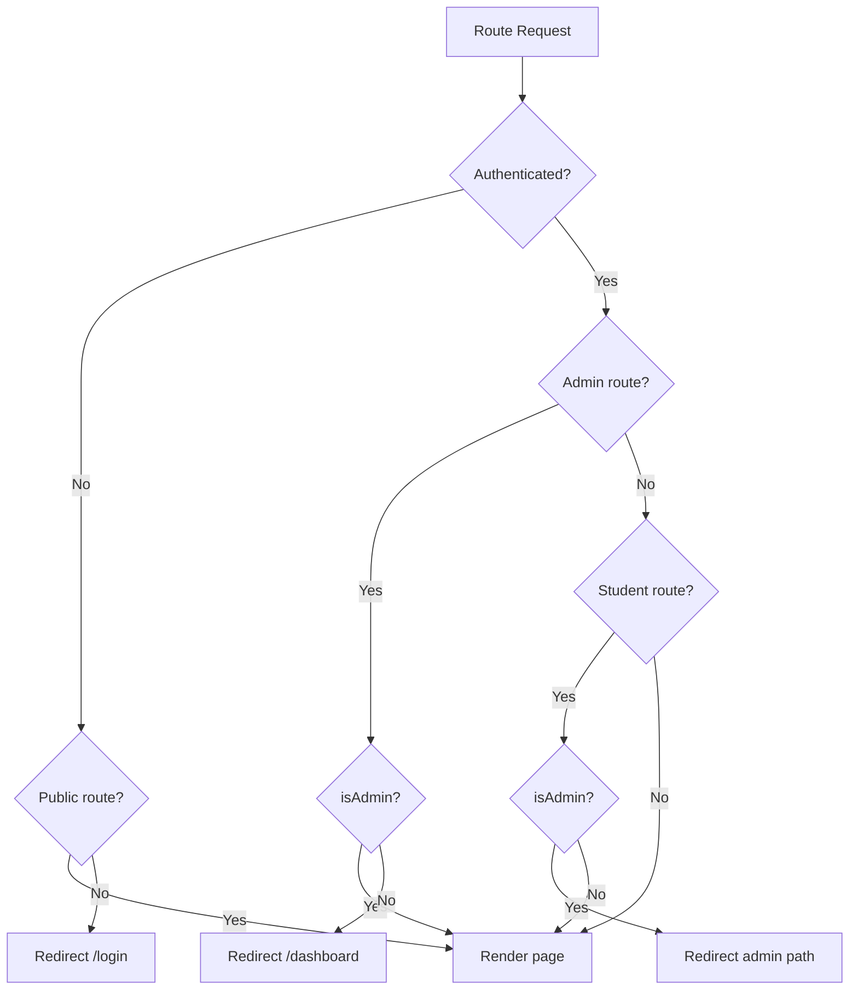

# Routing

> **Status:** ✅ IMPLEMENTED  
> **Source:** `src/app/router.tsx`  
> **Strategy:** React Router v6 with lazy loading

## Architecture

Routes are defined in `src/app/router.tsx` — the single source of truth for all client-side routing.

## Route Table

### Public Routes (LandingLayout)

| Path | Type | Component | Description |
|------|------|-----------|-------------|
| `/` | Page | LandingPage | Marketing landing page (scroll-snap sections) |
| `/terms` | Page | TermsPage | Terms of service |
| `/blogs/:slug` | Page | BlogPostPage | Individual blog post |
| `/anansi` | Redirect | `→ /#anansi` | Redirects to landing Anansi section |
| `/services` | Redirect | `→ /#services` | Redirects to landing Services section |
| `/hpb` | Redirect | `→ /#bootcamp` | Redirects to landing Bootcamp section |
| `/learn` | Redirect | `→ /#bootcamp` | Legacy redirect to Bootcamp section |
| `/leaderboard` | Redirect | `→ /#leaderboard` | Redirects to landing Leaderboard section |
| `/leaderboard/all` | Redirect | `→ /#leaderboard` | Redirects to landing Leaderboard section |
| `/courses` | Redirect | `→ /#courses` | Redirects to landing Courses section |
| `/team` | Redirect | `→ /#team` | Redirects to landing Team section |
| `/quiteroot` | Redirect | `→ /#quiteroot` | Redirects to landing QuiteRoot section |
| `/blogs` | Redirect | `→ /#blogs` | Redirects to landing Blogs section |
| `/zero-day-market` | Redirect | `→ /#market` | Redirects to landing Market section |

### Auth Routes (Standalone)

| Path | Component | Description |
|------|-----------|-------------|
| `/login` | LoginPage | Email/password login |
| `/register` | RegisterPage | Account registration |
| `/forgot-password` | ForgotPasswordPage | Password reset request |
| `/reset-password` | ForgotPasswordPage | Password reset form (reuses ForgotPasswordPage) |
| `/verify-email` | VerifyEmailPage | Email verification |
| `/change-password` | ChangePasswordPage | Password change |
| `{ADMIN_PATH}` | LoginPage | Admin login (base64-encoded `/mr-robot`) |

### Student Routes (StudentLayout)

| Path | Component | Description |
|------|-----------|-------------|
| `/dashboard` | DashboardPage | Student dashboard |
| `/dashboard/bootcamps` | Redirect | Redirects to specific bootcamp |
| `/dashboard/bootcamps/:bootcampId` | BootcampCoursePage | Bootcamp curriculum browser |
| `/dashboard/bootcamps/:bootcampId/modules/:moduleId/rooms/:roomId` | BootcampRoomPage | Bootcamp room (module-based) |
| `/dashboard/bootcamps/:bootcampId/phases/:phaseId/rooms/:roomId` | BootcampRoomPage | Bootcamp room (phase-based) |
| `/dashboard/courses` | MyCoursesPage | Enrolled courses listing |
| `/dashboard/courses/:courseId` | CourseLessonPage | Course lesson viewer |
| `/dashboard/marketplace` | MarketplacePage | CP marketplace |
| `/dashboard/profile` | ProfilePage | Own profile |
| `/dashboard/profile/:username` | ProfilePage | User profile by username |
| `/dashboard/notifications` | NotificationsPage | Notifications |
| `/dashboard/settings` | SettingsPage | Account settings |
| `/dashboard/competitive` | CompetitivePage | Competitive features |
| `/dashboard/networks` | NetworksPage | Network lab |
| `/dashboard/labs` | LabsPage | Lab selection grid |
| `/dashboard/labs/privesc` | PrivescLab | Privilege escalation lab |
| `/dashboard/labs/passwords` | PasswordLab | Password cracking lab |
| `/dashboard/labs/sql-injection` | SqlInjectionLab | SQL injection lab |
| `/dashboard/labs/osint` | OsintLab | OSINT reconnaissance lab |
| `/dashboard/labs/kill-chain` | KillChainLab | Kill chain analysis lab |

### Legacy Redirects (Student)

| Path | Redirects To |
|------|-------------|
| `/bootcamps` | `/dashboard/bootcamps/bc_1775270338500` |
| `/marketplace` | `/dashboard/marketplace` |
| `/profile` | `/dashboard/profile` |
| `/notifications` | `/dashboard/notifications` |
| `/settings` | `/dashboard/settings` |
| `/courses/:courseId` | `/courses` (which redirects to `/#courses`) |

### Tool Full-Screen Routes (StudentOnly, no layout chrome)

| Path | Component | Description |
|------|-----------|-------------|
| `/dashboard/tools/ide` | IdeToolPage | Full-screen IDE |
| `/dashboard/tools/terminal` | TerminalToolPage | Full-screen terminal |
| `/dashboard/tools/network-visualizer` | NetworkVizToolPage | Full-screen network visualizer |

### Admin Routes (AdminLayout)

| Path | Component | Description |
|------|-----------|-------------|
| `{ADMIN_PATH}/dashboard` | AdminDashboardPage | Admin dashboard |

### Catch-All Routes

| Path | Component | Description |
|------|-----------|-------------|
| `/:handle` | PublicProfilePage | User public profile by handle |
| `*` | NotFoundPage | 404 page |

## Route Guards



## Lazy Loading

All page components are lazy-loaded via `React.lazy()`:

```tsx
const DashboardPage = lazy(() => import('../features/student/pages/DashboardPage'));
const LabsPage = lazy(() => import('../features/student/pages/labs/LabsPage'));
```

Wrapped in `<Suspense fallback={<PageLoader />}>` for loading states via the `Wrap` component.

## Page Transitions

Routes use `AnimatePresence` from Motion for fade transitions:

```tsx
<AnimatePresence mode="wait">
  <motion.div
    initial={{ opacity: 0 }}
    animate={{ opacity: 1 }}
    exit={{ opacity: 0 }}
    transition={{ duration: 0.25 }}
  >
    {children}
  </motion.div>
</AnimatePresence>
```

## 404 Handling

The catch-all `*` route renders `NotFoundPage`, which displays a styled 404 with a link back to the dashboard or landing page.
