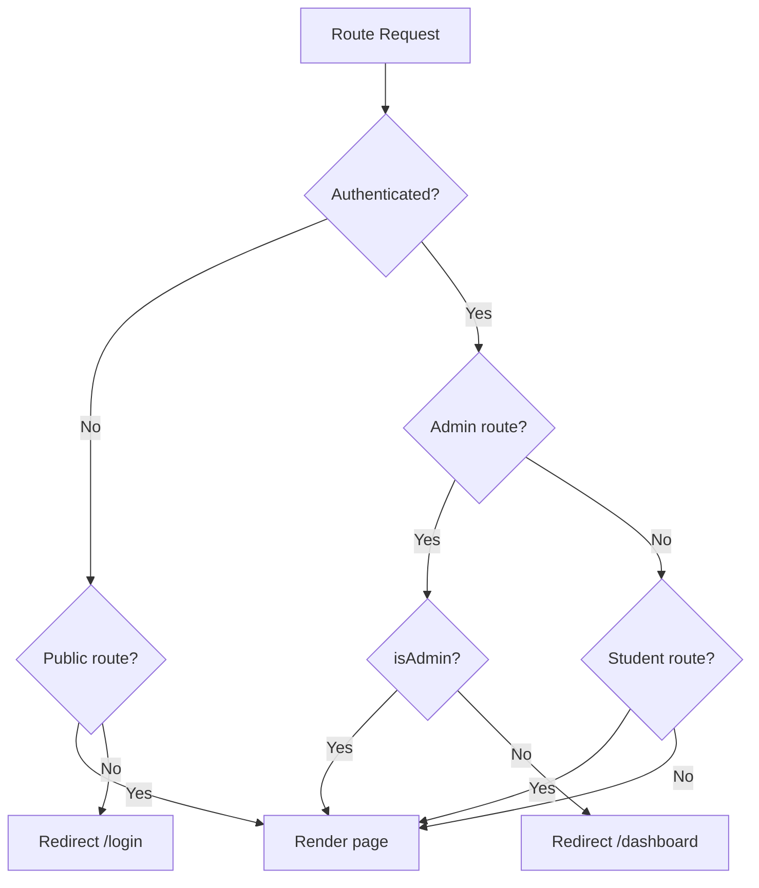

# Routing

## Architecture

Routes are defined in `src/app/router.tsx` — the single source of truth for all client-side routing.

## Route Table

### Public Routes (LandingLayout)

| Path | Component | Description |
|------|-----------|-------------|
| `/` | LandingPage | Marketing landing page |
| `/terms` | TermsPage | Terms of service |
| `/anansi` | AnansiPage | Anansi product page |
| `/quiteroot` | QuiteRootPage | QuiteRoot page |
| `/team` | TeamPage | Team page |
| `/services` | ServicesPage | Services page |
| `/hpb` | LearnPage | HPB overview |
| `/learn` | Redirect → `/hpb` | Legacy redirect |
| `/news` | PublicNewsPage | Public news feed |
| `/leaderboard` | LeaderboardPage | Top users |
| `/leaderboard/all` | FullLeaderboardPage | Complete leaderboard |
| `/events` | EventsPage | Upcoming events |
| `/courses` | CoursesPage | Course catalog |
| `/courses/:courseId` | CourseDetailPage | Individual course |
| `/zero-day-market` | ZeroDayMarketPage | Zero-day marketplace |

### Blog Routes (BlogsLayout)

| Path | Component | Description |
|------|-----------|-------------|
| `/blogs` | BlogListPage | Blog listing |
| `/blogs/:slug` | BlogPostPage | Individual blog post |

### Auth Routes (Standalone)

| Path | Component | Description |
|------|-----------|-------------|
| `/login` | LoginPage | Email/password login |
| `/register` | RegisterPage | Account registration |
| `/forgot-password` | ForgotPasswordPage | Password reset request |
| `/reset-password` | ResetPasswordPage | Password reset form |
| `/verify-email` | VerifyEmailPage | Email verification |
| `/change-password` | ChangePasswordPage | Password change |

### Student Routes (StudentLayout)

| Path | Component | Description |
|------|-----------|-------------|
| `/dashboard` | DashboardPage | Student dashboard |
| `/dashboard/bootcamps` | BootcampCoursePage | Bootcamp curriculum |
| `/dashboard/bootcamps/:bootcampId` | BootcampCoursePage | Specific bootcamp |
| `/dashboard/bootcamps/:bootcampId/phases/:phaseId/rooms/:roomId` | BootcampRoomPage | Walkthrough room |
| `/dashboard/courses` | MyCoursesPage | Enrolled courses |
| `/dashboard/courses/:courseId` | CourseLessonPage | Course lesson view |
| `/dashboard/marketplace` | MarketplacePage | CP marketplace |
| `/dashboard/profile` | ProfilePage | Own profile |
| `/dashboard/profile/:username` | ProfilePage | User profile |
| `/dashboard/news` | StudentNewsFeed | Student news |
| `/dashboard/notifications` | NotificationsPage | Notifications |
| `/dashboard/settings` | SettingsPage | Account settings |
| `/dashboard/competitive` | CompetitivePage | Competitive features |
| `/dashboard/networks` | NetworksPage | Network lab |
| `/dashboard/labs` | LabsPage | Lab selection grid |
| `/dashboard/labs/privesc` | PrivescLab | Privilege escalation |
| `/dashboard/labs/passwords` | PasswordLab | Password cracking |
| `/dashboard/labs/web-exploitation` | WebExploitationLab | Web exploitation |
| `/dashboard/labs/sql-injection` | SqlInjectionLab | SQL injection |
| `/dashboard/labs/phishing` | PhishingLab | Phishing analysis |
| `/dashboard/labs/proxy` | ProxyLab | Web proxy |
| `/dashboard/labs/traffic` | TrafficLab | Traffic analysis |
| `/dashboard/labs/osint` | OsintLab | OSINT reconnaissance |
| `/dashboard/labs/wireless` | WirelessLab | Wireless security |
| `/dashboard/labs/kill-chain` | KillChainLab | Kill chain analysis |

### Admin Routes (AdminLayout)

| Path | Component | Description |
|------|-----------|-------------|
| `{ADMIN_PATH}/dashboard` | AdminDashboardPage | Admin dashboard |

### Catch-All Routes

| Path | Component | Description |
|------|-----------|-------------|
| `/:handle` | PublicProfilePage | User public profile |
| `*` | NotFoundPage | 404 page |

## Route Guards



## Lazy Loading

All page components are lazy-loaded via `React.lazy()`:

```tsx
const DashboardPage = lazy(() => import('../features/student/pages/DashboardPage'));
const LabsPage = lazy(() => import('../features/student/pages/labs/LabsPage'));
```

Wrapped in `<Suspense fallback={<PageLoader />}>` for loading states.

## Page Transitions

Routes use `AnimatePresence` from Motion for fade transitions:

```tsx
<AnimatePresence mode="wait">
  <motion.div
    initial={{ opacity: 0 }}
    animate={{ opacity: 1 }}
    exit={{ opacity: 0 }}
    transition={{ duration: 0.25 }}
  >
    {children}
  </motion.div>
</AnimatePresence>
```

## 404 Handling

The catch-all `*` route renders `NotFoundPage`, which displays a styled 404 with a link back to the dashboard or landing page.
