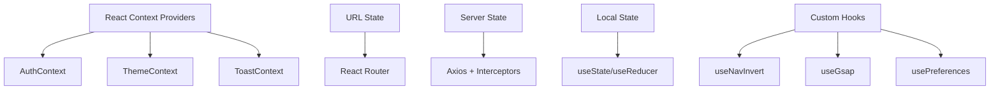

# State Management

## Philosophy

QYVORA Frontend uses **React Context + local component state** exclusively. No global state library (Redux, Zustand, Jotai) is used. This is intentional — the app's state is largely server-driven, and Context provides sufficient provider-level state without added complexity.

## State Architecture

## Context Providers

### AuthContext

**Source:** `src/core/contexts/AuthContext.tsx`

| Value | Type | Description |
|-------|------|-------------|
| `user` | `User \| null` | Current authenticated user object |
| `isAdmin` | `boolean` | Whether user has admin role |
| `login` | `(email, password) => Promise<void>` | Authenticate and set user |
| `logout` | `() => Promise<void>` | Clear session and user |
| `loading` | `boolean` | Initial auth check in progress |

The user object contains: `uid`, `username`, `email`, `role`, `cp`, `displayName`, `avatar`, `bio`, `handle`, `socialLinks`, `joinedAt`.

### ThemeContext

**Source:** `src/core/contexts/ThemeContext.tsx`

Manages dark/light theme switching. Currently the app is dark-only, but the provider exists for future theme support.

### ToastContext

**Source:** `src/core/contexts/ToastContext.tsx`

| Value | Type | Description |
|-------|------|-------------|
| `addToast` | `(message, type) => void` | Show a toast notification |
| `toasts` | `Toast[]` | Active toast queue |

Toast types: `success`, `error`, `info`, `warning`.

## URL State

React Router provides URL-based state for:

- **Route parameters:** `useParams()` for `:courseId`, `:labType`, `:slug`, `:handle`
- **Location:** `useLocation()` for current path, search params
- **Match:** `useMatch()` for conditional route matching (e.g., detecting course vs. bootcamp room)
- **Navigation:** `useNavigate()` for programmatic routing

## Server State

All server state flows through the Axios client (`src/core/services/api.ts`):

- No client-side cache (React Query, SWR not used)
- Fresh data fetched on each page load
- Token refresh handled transparently by interceptors
- Error responses surfaced via ToastContext

## Custom Hooks

| Hook | Source | Purpose |
|------|--------|---------|
| `useNavInvert` | `src/shared/hooks/useNavInvert.ts` | Detect `data-nav-invert` element overlap with navbar |
| `useGsap` | `src/shared/hooks/useGsap.ts` | GSAP animation setup |
| `usePreferences` | `src/shared/hooks/usePreferences.ts` | User preference persistence |

## Local Component State

The majority of UI state lives in component-level `useState`:

- Form inputs, modals, dropdowns, tabs
- Loading states for async operations
- Optimistic UI updates
- Animation state (scroll position, visibility)

This is deliberate — keeping state local reduces re-render scope and simplifies debugging.

## Why No Global State Library

1. **Server-driven app** — Most data comes from the API, not client-generated
2. **Simple provider state** — Auth, theme, and toasts are the only cross-cutting concerns
3. **Performance** — Local state avoids unnecessary re-renders
4. **Bundle size** — No Redux/Zustand adds zero bytes
5. **Complexity** — Context + hooks covers all use cases without abstraction overhead

If the app grows to require complex client-side state (e.g., real-time collaboration, offline-first), Zustand would be the recommended addition due to its minimal API and zero boilerplate.
