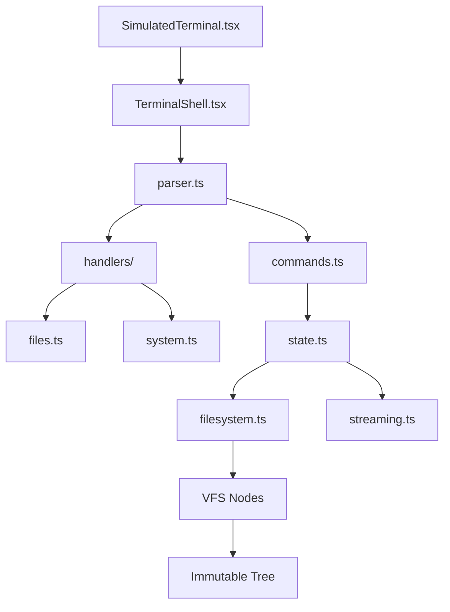

# Terminal Simulation

> **Status:** ✅ IMPLEMENTED  
> **See Also:** `SIMULATIONS.md` for complete simulation system documentation  
> **Component:** `src/features/student/components/SimulatedTerminal/`

## Overview

QYVORA includes a fully-functional in-browser terminal simulator that replicates a Kali Linux environment for educational purposes. This terminal supports 114+ commands and includes a complete virtual filesystem (VFS).

**Source:** `src/features/student/components/SimulatedTerminal/`

## Architecture



## Engine Components

### Parser (`parser.ts`)

Parses user input into structured command objects:
- Handles quoted strings, escape characters
- Splits command name and arguments
- Supports pipe operators (future)

### Commands (`commands.ts`)

114 commands registered in the command registry. Each command maps to a handler function.

**Categories:**
- File operations: `ls`, `cd`, `pwd`, `cat`, `echo`, `touch`, `mkdir`, `rm`, `cp`, `mv`, `chmod`, `chown`
- Text processing: `grep`, `sed`, `awk`, `cut`, `sort`, `uniq`, `wc`, `head`, `tail`
- System: `ps`, `kill`, `top`, `df`, `du`, `uname`, `whoami`, `id`, `groups`
- Network: `ifconfig`, `ip`, `ping`, `netstat`, `ss`, `curl`, `wget`, `nmap`, `dig`, `nslookup`
- Security: `john`, `hashcat`, `hydra`, `sqlmap`, `nikto`, `dirb`, `wfuzz`, `whatweb`, `wpscan`, `medusa`, `ncrack`, `cewl`
- Package management: `apt`, `pip`
- Text editors: `nano`, `vi`
- Utilities: `history`, `clear`, `man`, `which`, `find`, `locate`, `realpath`, `tee`, `xargs`, `journalctl`, `dmesg`

### Filesystem (`filesystem.ts`)

Immutable virtual file system (VFS):
- Tree of `VFSNode` objects
- Each node: `name`, `type` (file/dir), `content`, `permissions`, `owner`, `group`, `children`
- Operations return new trees (never mutate original)
- Path resolution with `findNode()`
- Child management with `addChild()`, `removeChild()`

### State (`state.ts`)

Terminal state management:
```typescript
interface TerminalState {
  cwd: string;
  user: string;
  hostname: string;
  home: string;
  env: Record<string, string>;
  history: string[];
  historyIndex: number;
  root: VFSNode;
  isRoot: boolean;
  aliases: Record<string, string>;
  lastExitCode: number;
  discoveredIps: string[];
}
```

### Streaming (`streaming.ts`)

Simulates command output streaming:
- Character-by-character output for realism
- Configurable delay between characters
- Supports interrupted output (Ctrl+C)

## Security Model

- All operations are sandboxed to the VFS
- No access to real browser filesystem
- Commands like `sudo` exist but are limited
- No actual network operations (simulated)
- No real package installation (simulated apt/pip)

## Components

### SimulatedTerminal.tsx

Main terminal component:
- Dialog overlay (Radix)
- Terminal chrome (title bar, window controls)
- Command input with history navigation
- Output display with scroll
- Kali Linux themed styling

### TerminalShell.tsx

Command execution shell:
- Parses input
- Routes to command handlers
- Manages state transitions
- Handles errors and exit codes

## Keyboard Shortcuts

| Key | Action |
|-----|--------|
| `Enter` | Execute command |
| `↑` / `↓` | Navigate command history |
| `Tab` | Autocomplete (future) |
| `Ctrl+C` | Cancel running command |
| `Ctrl+L` | Clear terminal |

## Integration

The terminal is accessible from:
- Dashboard topbar (terminal icon button)
- Lab walkthroughs (embedded terminal)
- Bootcamp rooms (contextual terminal)
- Custom event: `qyvora:open-terminal`
